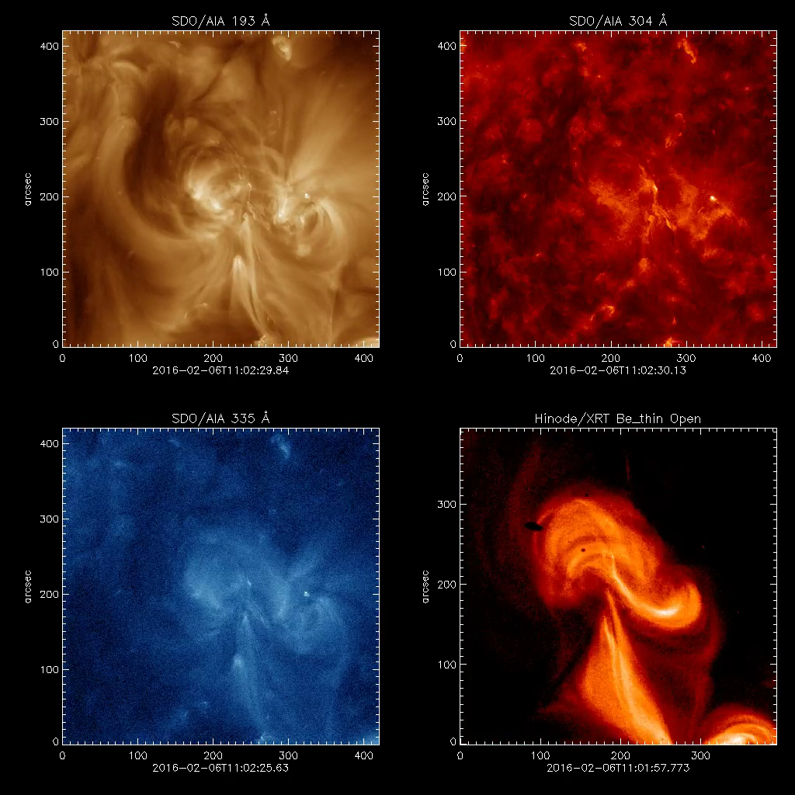

.. Sigmoid_Catalog documentation master file, created by
   sphinx-quickstart on Fri Jan  4 08:50:04 2019.
   You can adapt this file completely to your liking, but it should at least
   contain the root `toctree` directive.

Welcome to the Sigmoid Catalog's documentation!
===========================================

.. toctree::
   :maxdepth: 2
   :caption: Contents:

Sigmoids, aptly named for their S-shaped coronal field lines,
frequently produce both Coronal Mass Ejections (CMEs) and flares,
which are drivers of space weather at Earth.
Space weather may cause everything from aurorae to power black outs,
so studying sigmoids are partically important.
Along with their practical importance, 
Sigmoids are likely due to theortically proposed flux ropes.
As such, studying Sigmoids has practical and physical benefits.

The initial sigmoid catalog `(Savcheva et al. 2014) <https://ui.adsabs.harvard.edu/?#abs/2014SoPh..289.3297S>`_
contains 79 sigmoids discovered by searching twice daily syntopic Hinode X-ray Telescope (XRT) observations between 2007 and 2012 (`catalog webpage <http://aia.cfa.harvard.edu/sigmoid/>`_).
Version 2 of the catalog, of which the code is detailed here,
expands the initial Sigmoid Catalog through 2017.
This expansion creates a database of 295 sigmoids.
In addition, we measure new parameters, not in the first iteration of the catalog.
Here I will detail the code used to analyze sigmoids in version 2 of the Sigmoid Catalog.

******************
User Documentation
******************

.. _toplevel-downloading-code:
Downloading Codes
-----------------

The codes linked below will download the required files for the Sigmoid Catalog. 

.. toctree::
   :maxdepth:1
   
   downloading_code/get_hmi_files_cutout/index
   downloading_code/get_aia_files_cutout/index
   downloading_code/get_aia_files/index
   automated_measurement_code/get_solarmonitor_links_dirty/index

.. _toplevel-manual-measurement-code:
Manual Measurement Codes
------------------------

The codes linked below measure sigmoid properties with user input.

.. toctree::
   :maxdepth:1
  
   manual_measurement_code/sigmoidsize_adv/index
   manual_measurement_code/filament_selector/index
   automated_measurement_code/make_hmi_movie_cutout_man_thres/index
   

.. _toplevel-automated-measurement-code:
Automated Measurement/Analysis Codes
------------------------------------

The codes linked below measure sigmoid properties without user input.

.. toctree::
   :maxdepth:1

   automated_measurement_code/make_aia_flare_movies/index
   automated_measurement_code/make_hmi_movie_cutout/index

.. _toplevel-automated-measurement-code:
Automated Measurement/Analysis Codes
------------------------------------

The codes format the obseravtions into a nice package, which we use in the webpage.

.. toctree::
   :maxdepth:1

   automated_measurement_code/create_json_for_web/index
   automated_measurement_code/create_combined_movies/index

Indices and tables
==================

* :ref:`genindex`
* :ref:`modindex`
* :ref:`search`
